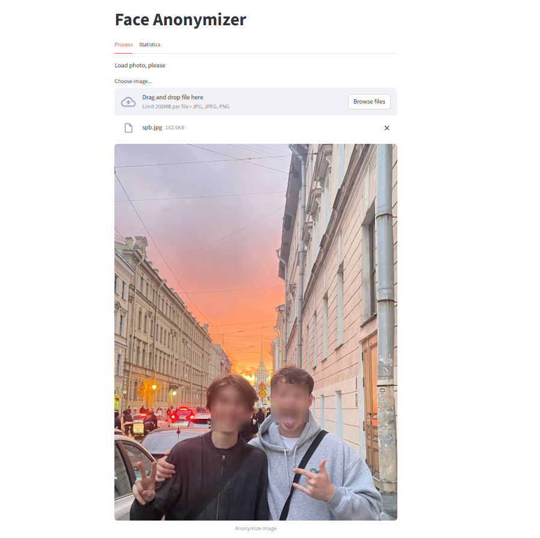
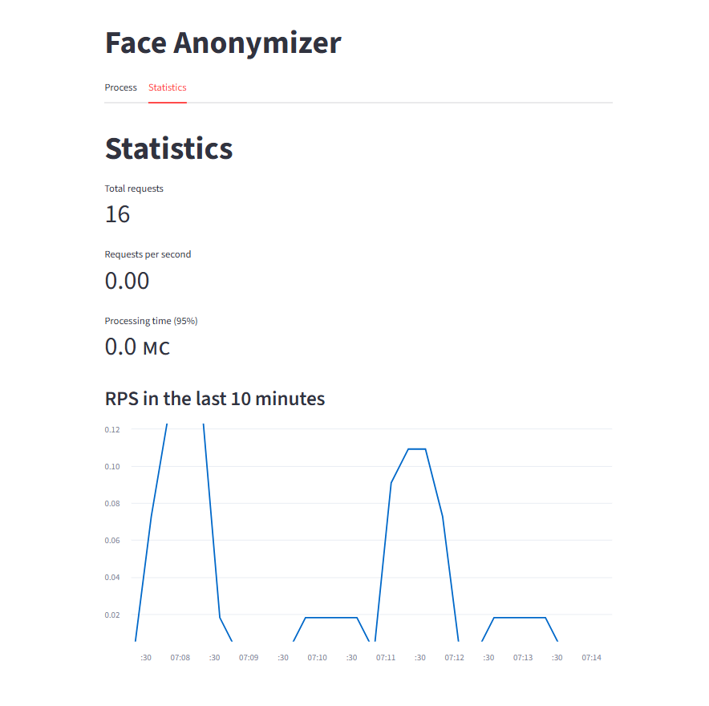

# Face Anonymizer

Сервис для анонимизации лиц на фото: загрузил изображение — получил версию с размытыми лицами.  
Построен на Python, использует MediaPipe для детекции и работает через веб-интерфейс.

Плюс — всё завернуто в Docker, а ещё есть мониторинг через Prometheus, потому что интересно видеть, как система себя ведёт под нагрузкой.

---

## Как это выглядит

| Загрузка и результат | Статистика |
|----------------------|------------|
|    |  |

---

## Что внутри

- **Бэкенд** — FastAPI + OpenCV + MediaPipe (ищет лица и размывает)
- **Фронтенд** — Streamlit (простой веб-интерфейс)
- **Мониторинг** — Prometheus собирает метрики: сколько запросов пришло, сколько времени заняла обработка, были ли ошибки
- Всё это упаковано в Docker и поднимается одной командой

---

## Как запустить

1. Убедись, что у тебя установлены [Docker](https://www.docker.com/) и [Docker Compose](https://docs.docker.com/compose/).
2. Склонируй репозиторий:
   ```bash
   git clone https://github.com/Wkdk00/Face-Anonymizer.git
   cd Face-Anonymizer
   ```
3. Запусти:
   ```bash
    docker-compose up --build
   ```
4. Открой в браузере: http://localhost:8501

Готово! Можно грузить фото и смотреть, как оно обрабатывается.

---
## А зачем статистика?
Потому что даже простой сервис интересно наблюдать:
- Сколько всего изображений обработано?
- Насколько быстро работает?
- Не падает ли под нагрузкой?

Все эти данные доступны во вкладке Statistics в интерфейсе. Под капотом — HTTP-метрики от *prometheus-fastapi-instrumentator*.

---

Январь 2026